## ElementUI/Vue.js/go 简易房间预定网站

### 运行环境

- Windows 10
- Windows Server 2019 Datacenter

### 安装与运行

- [部署前端（生产环境）](./front-end/README.md)
- [部署前端（开发环境）](./front-end-dev/README.md)
- [部署后端](./back-end/README.md)
- 本地测试时浏览器登录 ``localhost:8080``

### 使用说明

#### 总体介绍

- 账户分为普通用户和管理员，初始默认存在用户名分别为 'JJ' 和 Admin'' 的普通用户和管理员，密码均为 "123"
- token 等用户信息存在 sessionStorage 中，因此登陆信息只在当前标签页内有效；在未登录情况下访问子组件将会跳转回登陆页面
- 服务器除 token 外的数据存储会保存在数据库中，因此重启服务器数据仍然保留，但登录会失效，需要重返登陆界面进行登录
- 网站中所有文本框均没有对文本类型或格式做检测，只检查了是否为空，以 string 保存，使用任意字符串均没有错误
- 网站中的所有时间均没有检查与现实时间的关系，例如该时间是否已经过去了

#### 登陆界面

- 使用用户名和密码登录，服务器会识别是普通用户还是管理员，根据用户类型跳转页面
- 此页面的注册功能只能注册普通用户

## 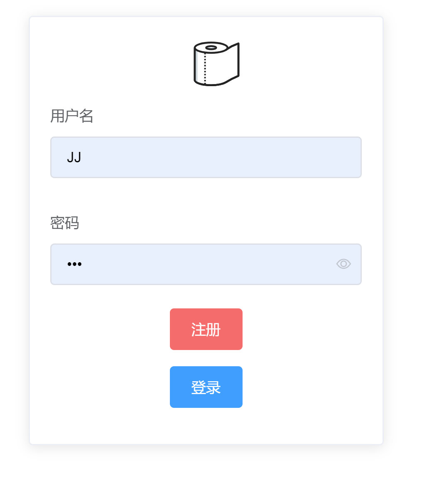

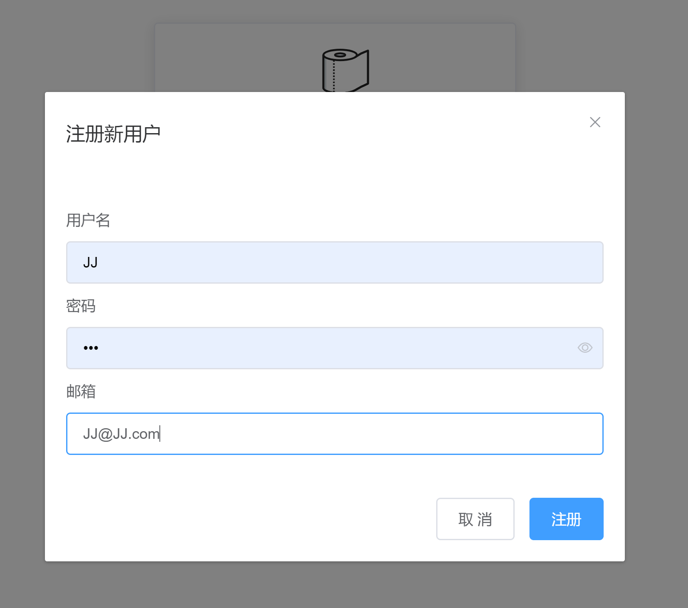

- 游客评论界面

  随便输入昵称和内容即可发表评论

  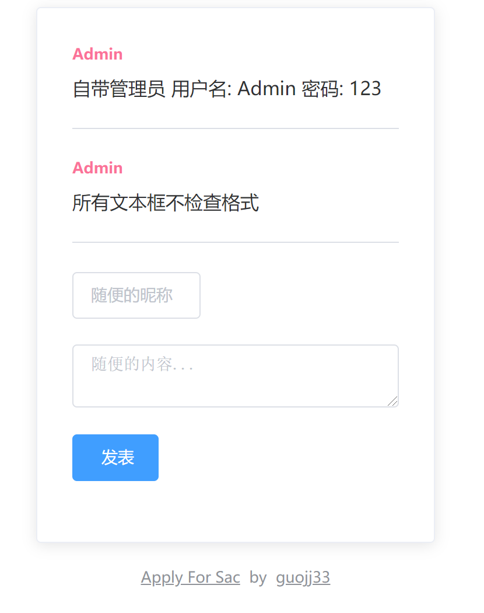

#### 用户界面

##### 查看占用情况

- 选择查看的房间之后才会显示数据
- 不显示被拒绝的申请
- 日期过滤器存在一个小缺陷，需要按照图中顺序才能开启，有些繁琐
- 列表中的“原因”一列，当用户类型为普通用户时，会显示“-”，表示保护隐私；为管理员，则会显示具体原因

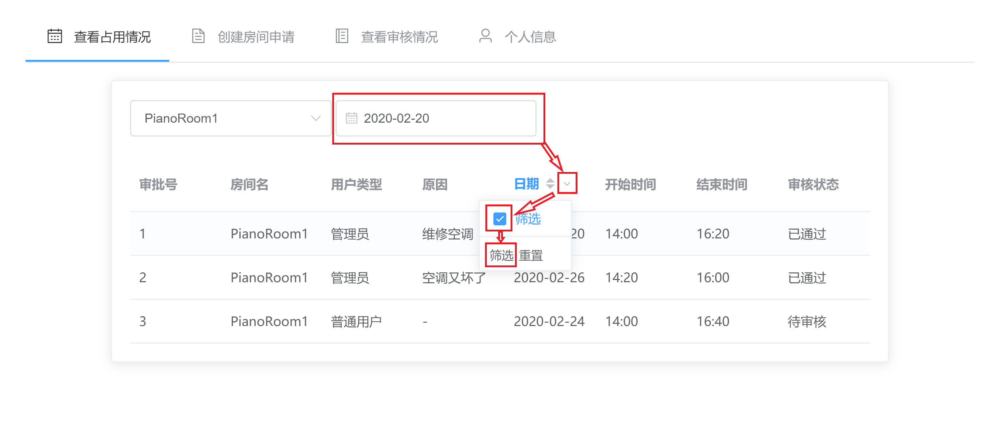

##### 创建房间申请

- 申请表全部为必填项
- 选择开始时间后，结束时间选择器才能激活，后者的时间选择列表会根据前者的选择而变化，保证结束时间比开始时间晚
- 只有当时间没有冲突时，才能创建成功

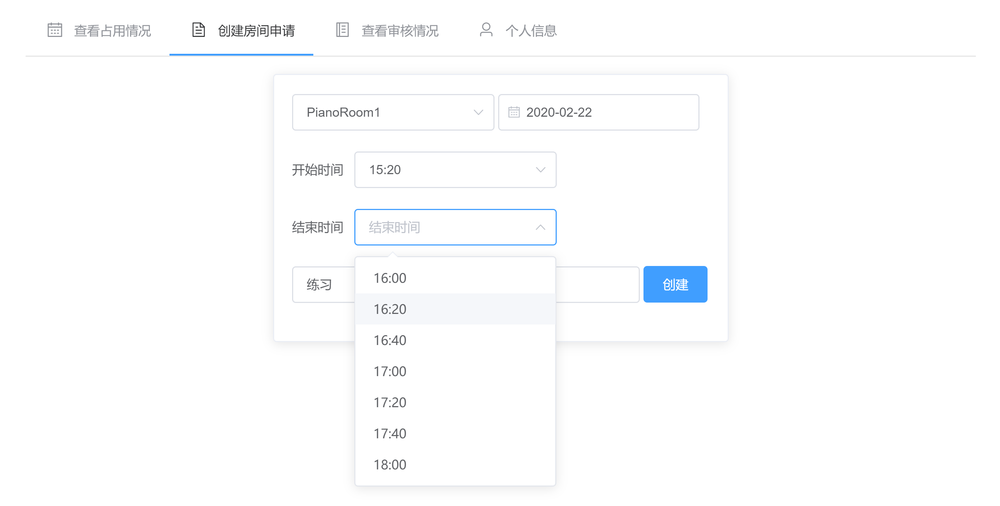

##### 查看审核情况

- 显示了当前用户创建的所有的任何状态的申请

- 审核表显示了审核状态，审核状态包括待审核、已通过、未通过
- 除审核状态为未通过或者该申请已经被签到（在管理员界面可以看到）时，用户均可取消申请，取消后申请记录会保存

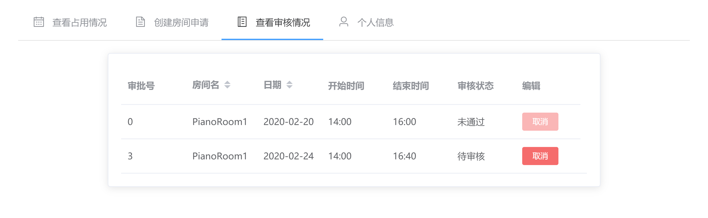

##### 个人信息

- 显示用户信息，不能修改
- 点击退出登录，前端和后端都会清楚对应的 token

#### 管理员界面

##### 查看占用

- 与用户界面的相似，但是无论用户类型是什么，都会显示具体原因

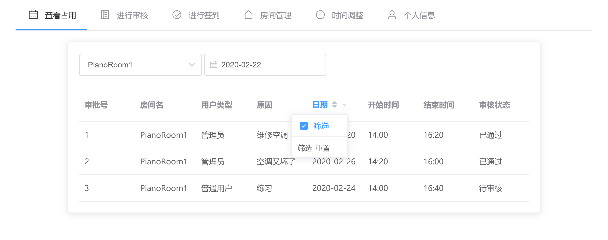

##### 进行审核

- 不显示用户已经取消的申请

- 点击表头中的“日期”可以按照日期排序
- 拒绝和通过操作均不可逆，点击任意一个若成功，则变暗不可再点击

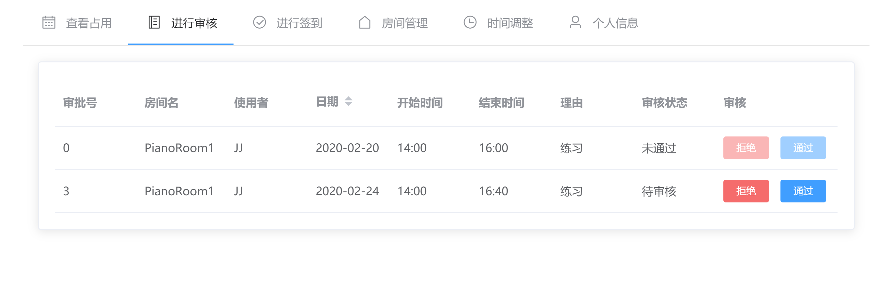

##### 进行签到

- 只有通过审核且没有被用户取消的申请
- 签到操作同样不可逆

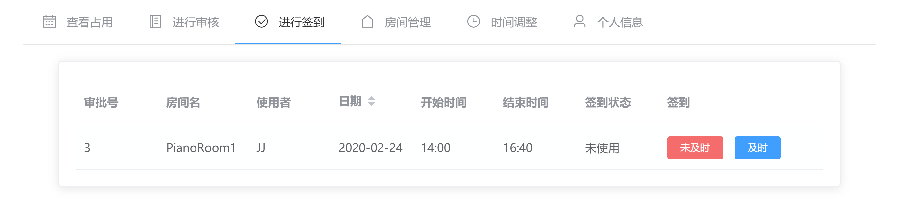

##### 房间管理

- 可以创建房间，但不能删除
- 创建后，网站的所有房间列表选择器均会更新

##### 时间调整

- 其实就是管理员级别的申请，创建时会自动把与该时间冲突的用户的申请全部拒绝。
- 创建的申请的使用者是一个名为“SAC”的虚拟账户（即并不存在此账户，不能登录，无法注册同名账号），在查看占用界面显示的管理员类型账户其实就是这个虚拟账户（谜之设定）

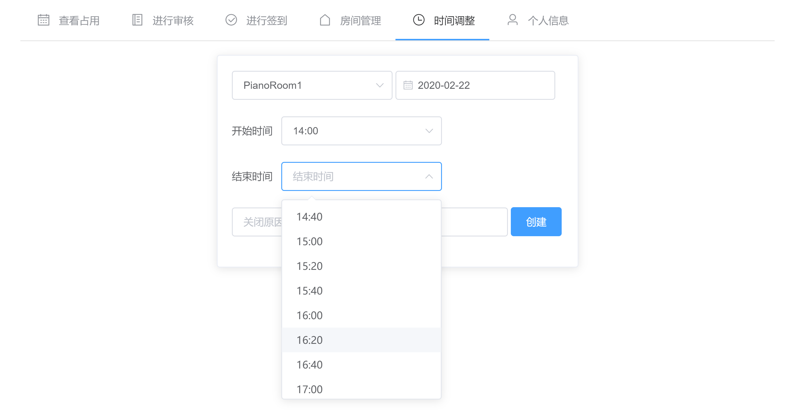

##### 账户管理

- 可以查看所有存在的普通用户与管理员

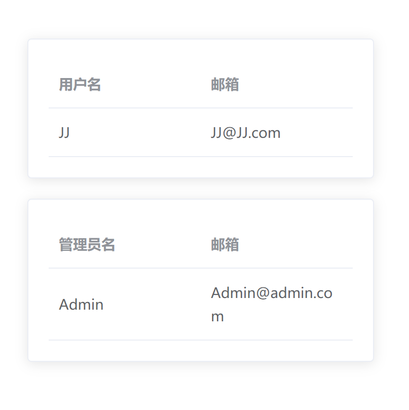

##### 登出/注册

- 可以注册新管理员，即新管理员只能由已存在管理员注册得到

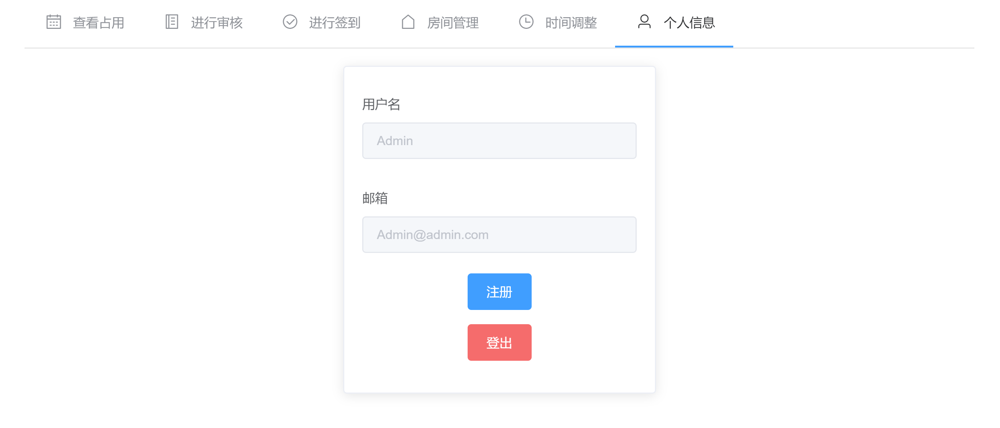

